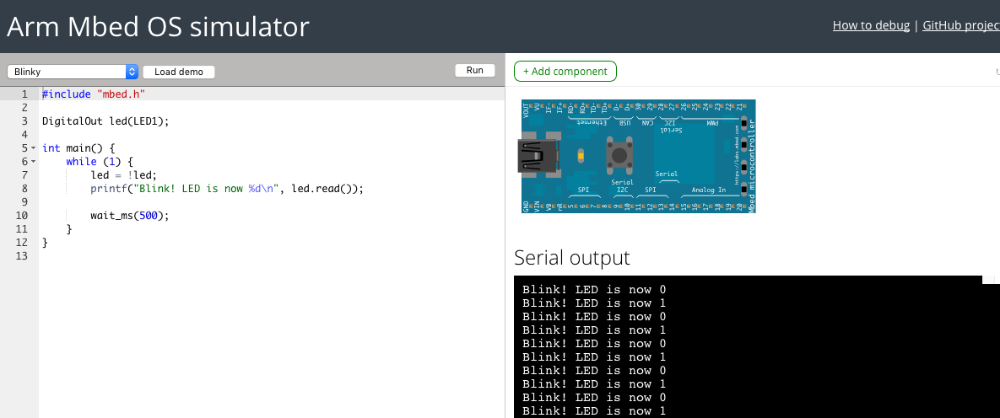
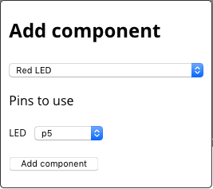
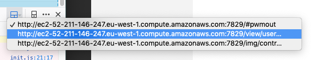
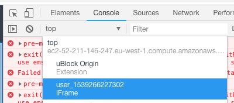
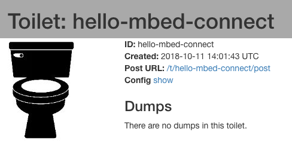
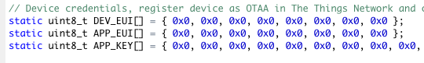

# Mbed Simulator workshop - Mbed Connect 2018

The Mbed Simulator allows you to quickly prototype and test Mbed OS applications without having to go through the compile/flash/debug cycle that you go through on a normal board. This workshop explores the simulator, and shows a couple of ways to shorten your development time.

The simulator can be used in two ways:

1. Online - via https://labs.mbed.com/simulator/.
1. Offline - installation instructions at https://github.com/janjongboom/mbed-simulator.

In this workshop we'll use the online simulator, and will look at some ways of integration the simulator in your offline workflow.

## 1. The online environment

First, open the [simulator](https://labs.mbed.com/simulator/).



The online simulator consists of two parts: a code editor on the left, and a virtual board area on the right. Let's add a new LED, and make it blink.

1. Click **Add component**.

    

1. Select 'Red LED', and 'p5'.

    

1. In the code, change `LED1` to `p5`.
1. Click **Run**.

Pretty straight forward. We can also make the LED dependend on the input of an analog pin. To do so:

1. Click **Add component**.
1. Select 'Thermistor', and 'p15'.
1. Change the code so it reads:

    ```
    #include "mbed.h"

    DigitalOut led(p5);
    AnalogIn therm(p15);

    int main() {
        while (1) {
            led = therm > 0.5f ? 1 : 0;
            wait_ms(20);
        }
    }
    ```

1. Click **Run**.

## 2. Automation

The simulator can programmatically change sensor values, which is useful to test how a program would react to changing environments. Here is a program which will toggle LEDs depending on the value of the thermistor:

```cpp
#include "mbed.h"

DigitalOut led1(LED1);
DigitalOut led2(LED2);
DigitalOut led3(LED3);
DigitalOut led4(LED4);

AnalogIn therm(p15);

int main() {
    float lastV = therm.read();
    while (1) {
        float v = therm.read();
        led1 = v >= 0.20f;
        led2 = v >= 0.40f;
        led3 = v >= 0.60f;
        led4 = v >= 0.80f;

        if (lastV != v) {
            printf("Thermistor value is now %.2f\n", v);
            lastV = v;
        }

        wait_ms(20);
    }
}
```

Click **Run** and verify that the application works.

Now let's run some automation. This depends on the browser you're running in.

**Firefox**

1. Open the Developer Tools via *Tools > Web Developer > Toggle Tools*.
1. Click the 'frame' icon, and select the one that has '/view/user' in it.

    

1. In the console, enter:

    ```js
    var values = [4, 2, 1, 3.5, 2.1 ];
    var therm  = document.querySelector('.thermistor input');

    var iv = setInterval(() => {
        if (values.length === 0) clearInterval(iv);
        therm.value = values.shift();
        console.log('value', therm.value);
        therm.dispatchEvent(new CustomEvent('change'));
    }, 600)
    ```

1. Press 'Enter'.

**Chrome**

1. Open the Developer Tools via *View > Developer > Developer Tools*.
1. Click **Console**.
1. Select the 'user_XXX' option.

    

1. In the console, enter:

    ```js
    var values = [4, 2, 1, 3.5, 2.1 ];
    var therm  = document.querySelector('.thermistor input');

    var iv = setInterval(() => {
        if (values.length === 0) clearInterval(iv);
        therm.value = values.shift();
        console.log('value', therm.value);
        therm.dispatchEvent(new CustomEvent('change'));
    }, 600)
    ```

1. Press 'Enter'.

## 3. Networking

The simulator has full access to UDP & TCP sockets, and has the [Mbed HTTP](https://os.mbed.com/teams/sandbox/code/mbed-http/) library built in. Let's send some data over the internet...

1. Go to [ptsv2.com](http://ptsv2.com/) - this is a place to send some data.
1. Type a name, or click **New random toilet**.
1. Write down the 'ID'.

    

Time to dump some data in this toilet. As you (hopefully) know Mbed OS has unified networking APIs, which lets you use any IP connectivity method in the same way. In the simulator we simulate an Ethernet connection. So to do an HTTP request you:

1. Set up an `EthernetInterface` object.
1. Call `connect()` on it.
1. Create a new `HttpRequest`, passing in the object.

In the simulator enter:

```cpp
#include "mbed.h"
#include "EthernetInterface.h"
#include "http_request.h"
#include "Sht31.h"

// !!! Enter your ID here !!!
#define TOILET_BOWL         "your-id-here-pls"

void dump_response(HttpResponse* res) {
    printf("Status: %d - %s\n", res->get_status_code(), res->get_status_message().c_str());

    printf("Headers:\n");
    for (size_t ix = 0; ix < res->get_headers_length(); ix++) {
        printf("\t%s: %s\n", res->get_headers_fields()[ix]->c_str(), res->get_headers_values()[ix]->c_str());
    }
    printf("\nBody (%d bytes):\n\n%s\n", res->get_body_length(), res->get_body_as_string().c_str());
}

void store_data(NetworkInterface *network, const char *body, size_t body_len) {
    HttpRequest post_req(network, HTTP_POST, "http://ptsv2.com/t/" TOILET_BOWL "/post");
    post_req.set_header("Content-Type", "text/plain");

    HttpResponse* post_res = post_req.send(body, body_len);
    if (!post_res) {
        printf("HttpRequest failed (error code %d)\n", post_req.get_error());
        return;
    }

    printf("\n----- HTTP POST response -----\n");
    dump_response(post_res);
}

int main() {
    EthernetInterface network;
    if (network.connect() != 0) {
        printf("Cannot connect to the network, see serial output");
        return 1;
    }

    const char body[] = "Wow Mbed Simulator such cool, much wow";
    store_data(&network, body, strlen(body));

    wait(osWaitForever);
}
```

**Make sure to put your ID in the define on line 5!**

Then:

1. Run this example.
1. Look back in your toilet bowl (at http://ptsv2.com/t/your-id).
1. See that there is now data.

## 4. Sending temperature data

Right now we send static data, and only when we load the example. Let's send some real data, and also do it periodically.

1. Click **Add component**.
1. Select 'Sht31 temperature / humidity sensor'.
1. Click **Add component**.
1. Change the `main` function so it reads:

    ```cpp
    int main() {
        EthernetInterface network;
        if (network.connect() != 0) {
            printf("Cannot connect to the network, see serial output");
            return 1;
        }

        static Sht31 sht31(I2C_SDA, I2C_SCL);

        while (1) {
            char body[1000] = { 0 };
            int len = snprintf(body, sizeof(body), "Temperature = %.2f", sht31.readTemperature());
            if (len > 0) {
                printf("\nSending: %s\n", body);
                store_data(&network, body, len);
            }

            wait_ms(5000);
        }
    }
    ```

1. Click **Run**.

## 5. LoRaWAN

The simulator can also talk LoRaWAN to The Things Network. We use this internally to verify our stack and to do development.

1. Use [these steps](https://github.com/ARMmbed/mbed-connect-2018-lorawan#setting-up) to:
    * Create an account at The Things Network.
    * Register a device.
    * Retrieve device credentials (Device EUI, Application EUI and Application Key).
1. Load the 'LoRaWAN' example in the simulator.
1. Enter the credentials you retrieved from TTN on lines 8-11.

    

1. Click **Run**.

Look in The Things Network 'Data' tab to see the device joining the network. Click the button on the simulated device (on the development board) to send data.

## 6. Future

The simulator also runs offline, and can then integrate with any Mbed OS project. This is very useful for local development flows, as it supports multiple files, folders, custom drivers, and new components. I'm very excited to see what you will build with it!

Install instructions can be found at https://github.com/janjongboom/mbed-simulator


